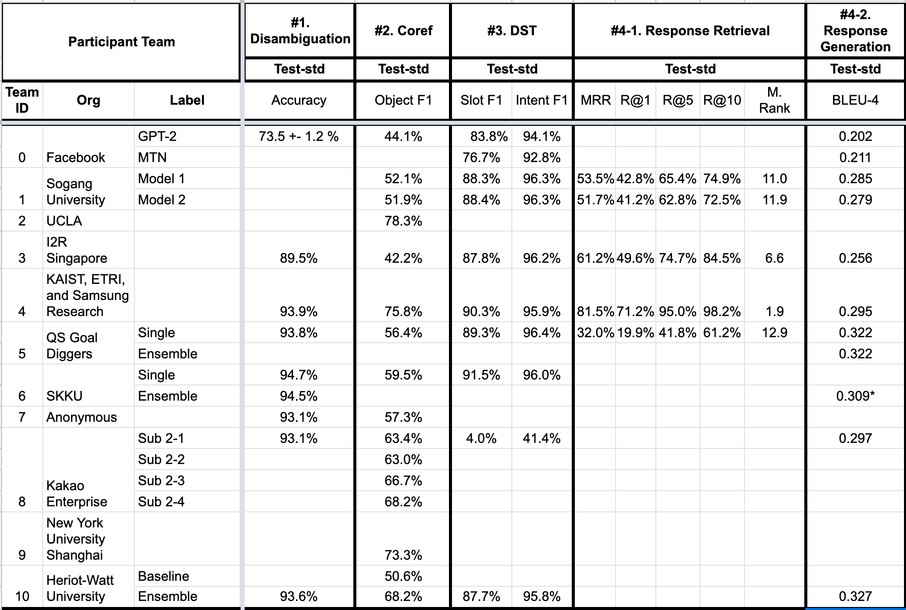

# SIMMC 2.0 Final Results

We are excited to announce the results of the Situated and Interactive Multimodal Conversations (SIMMC) 2.0 track in the DSTC10 2021 edition. Congratulations to the winners and a huge thank you to all the participants!

| Subtask                                       | Winner                                                                           | Runner-up                                                                                          |
|-----------------------------------------------|----------------------------------------------------------------------------------|----------------------------------------------------------------------------------------------------|
| #1: Disambiguation                            | Team 6 (SKKU)                                                                    | Team 4 (KAIST, ETRI, Samsung Research), Team 5 (QS Goal Diggers), Team 10 (Heriot-Watt University) |
| #2: Multimodal Co-ref Resolution              | Team 4 (KAIST, ETRI, Samsung Research)                                           | Team 9 (NYU)                                                                                       |
| #3: Dialog State Tracking                     | Team 6 (SKKU)                                                                    | Team 4 (KAIST, ETRI, Samsung Research)                                                             |
| #4-1: Assistant Response Generation           | Team 5 (QS Goal Diggers), Team 10 (Heriot-Watt University) | Team 4 (KAIST, ETRI, Samsung Research), Team 8 (Kakao Enterprise)                                  |
| #4-2: Assistant Response Retrieval            | Team 4 (KAIST, ETRI, Samsung Research)                      | Team 3 (I2R A-STAR)                                                                                |

Overall, the track received 16 model entries across the world. Below are the full results as of Oct 25, 2021.

<figure>
 
</figure>

Note:
* Open-source permission is pending for Team 2.
* Due to the file formatting issue, we were not able to evaluate Team 6's task 4-2 at the time of the challenge. 

Below is the full list of the participants and the links to their repositories (if released public).

| Team ID |              Org              |
|:-------:|:-----------------------------:|
|    0    | [Facebook](https://github.com/facebookresearch/simmc2)                      |
|    1    | [Sogang University](https://github.com/boychaboy/dstc10_simmc2)             |
|    2*   | UCLA                          |
|    3    | [I2R A-STAR](https://github.com/i2r-simmc/i2r-simmc-2021)                    |
|    4    | [KAIST, ETRI, Samsung Research](https://github.com/KAIST-AILab/DSTC10-SIMMC) |
|    5    | [QS Goal Diggers](https://github.com/dataminer996/DSTC10_Track3_QS_Goal_Diggers)               |
|    6    | [SKKU](https://github.com/Verylovenlp/SKKU_SIMMC2.0)                          |
|    7    | Anonymous Submission        |
|    8    | [Kakao Enterprise](https://github.com/rungjoo/simmc2.0)              |
|    9    | [NYU](https://github.com/i-need-sleep/MMCoref)                           |
|    10   | [Heriot-Watt University](https://github.com/Bhathiya-hw/simmc2)        |
