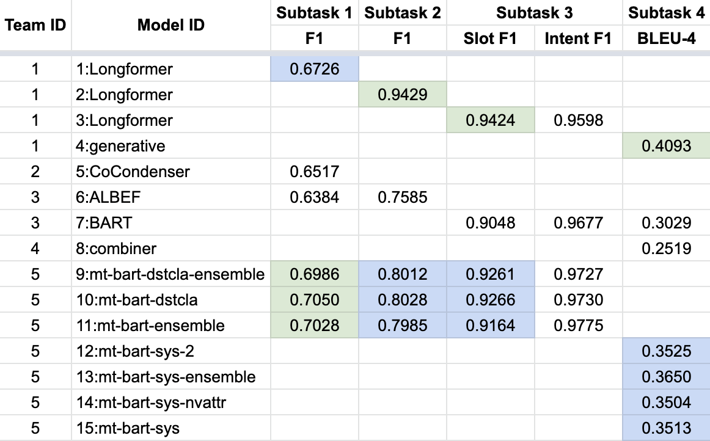

# SIMMC 2.1 Final Results

We are excited to announce the results of the Situated and Interactive Multimodal Conversations (SIMMC) 2.1 track in the DSTC11 2022 edition. Congratulations to the winners and a huge thank you to all the participants!

| Subtask                                       | Winner                                                                           | Runner-up                                                                                          |
|-----------------------------------------------|----------------------------------------------------------------------------------|----------------------------------------------------------------------------------------------------|
| #1: Ambiguous Candidate Identification        | Team 5                                                                           | Team 1 |
| #2: Multimodal Co-ref Resolution              | Team 1                                           | Team 5                                                                                       |
| #3: Dialog State Tracking                     | Team 1                                                           | Team 5                                                             |
| #4: Assistant Response Generation           | Team 1 | Team 5                                  |

Overall, the track received 15 model entries across the world. 

<figure>
 
</figure>

Below is the full list of the participants and the links to their repositories (if released public).

| Team ID |              Org              |
|:-------:|:-----------------------------:|
|    0    | [Meta AI](https://github.com/facebookresearch/simmc2)                      |
|    1    | [Alibaba DAMO-ConvAI](https://github.com/AlibabaResearch/DAMO-ConvAI/tree/main/dstc11-simmc)             |
|    2    | [DSHW](https://github.com/JangDaesik/DSTC11_SIMMC2.1)                          |
|    3    | [SKKU, LG](https://github.com/bambidz/DSTC11_SIMMC2.1)                    |
|    4    | Anonymous |
|    5    | [SCUT-BDS-Lab](https://github.com/scutcyr/dstc11-simmc2.1-scut-bds-lab)               |
