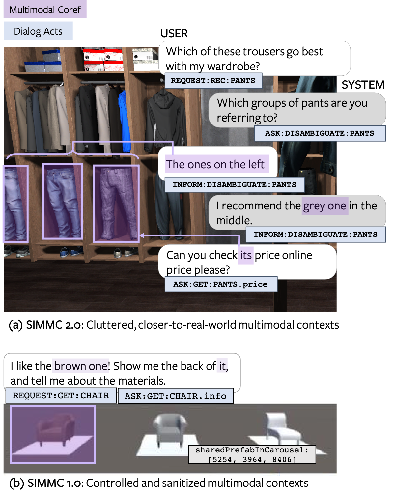

# The Second Situated Interactive MultiModal Conversations (SIMMC 2.0) Challenge 2021

Welcome to the Second Situated Interactive Multimodal Conversations (SIMMC 2.0) Track for [DSTC10][dstc10] 2021.

The SIMMC challenge aims to lay the foundations for the real-world assistant agents that can handle multimodal inputs, and perform multimodal actions.
Similar to the [First SIMMC challenge][simmc1] (as part of DSTC9), we focus on the **task-oriented** dialogs that encompass a **situated** multimodal user context in the form of a co-observed & immersive virtual reality (VR) environment.
The conversational context is **dynamically** updated on each turn based on the user actions (e.g. via verbal interactions, navigation within the scene).
For this challenge, we release a new Immersive SIMMC 2.0 dataset in the shopping domains: furniture and fashion.   

**Organizers**: Seungwhan Moon, Satwik Kottur, Paul A. Crook, Ahmad Beirami, Babak Damavandi, Alborz Geramifard

<figure>
 
<figcaption><i>Example from SIMMC-Furniture Dataset</i></figcaption> 
</figure>


### Latest News

* **[Oct 1, 2021]** [Test-Std set for the final evaluation](https://github.com/facebookresearch/simmc2/commit/8d23c4879dd873df311b6c49c0674896537b6087) is released. Please follow the [submission instructions carefully](https://github.com/facebookresearch/simmc2/blob/master/SUBMISSION_INSTRUCTIONS.md) and contact us if you have any questions.
* **[Sept 24, 2021]** Submission deadlines have been pushed to accommodate for a [slight change](https://github.com/facebookresearch/simmc2/commit/741e6d32dc354b7c17de7a1b5ec639343f4286d6) in the DST evaluation script. Please see the [Submission Instructions](SUBMISSION_INSTRUCTIONS.md) for more details on the dates.
* **[Sept 14, 2021]** Retrieval candidates for `dev` and `devtest` released.
* **[June 14, 2021]** Challenge announcement. Training / development datasets (SIMMC v2.0) are released.


## Important Links

* [Task Description Paper][simmc2_arxiv]
* [Challenge Registration](https://docs.google.com/forms/d/e/1FAIpQLSe9CgrlygYciIZH_pK8133fbp1kqigTB6JIP7utfNFx_xSm6A/viewform)
* [Data Formats](data/README.md)
* Baseline Details & Results: [Subtask1][subtask1_results], [Subtask 2, 3, 4][subtask2_results]
* [Challenge Instructions](#challenge-instructions)
* [Submission Instructions](SUBMISSION_INSTRUCTIONS.md)


## Timeline

**NOTE**: All deadlines are 11:59PM UTC-12:00 ("anywhere on Earth"), unless otherwise noted.

| **Date** | **Milestone** |
| :--: | :-- |
| June 14, 2021 | Training & development data released |
| ~~Sept 24~~ ***Oct 1***, 2021  | Test-Std data released, End of Challenge Phase 1 |
| ~~Oct 1~~ ***Oct 8***, 2021 | Entry submission deadline, End of Challenge Phase 2 |
| ~~Oct 8~~ ***By Oct 15***, 2021 | Final results announced |


## Track Description

### Tasks and Metrics

We present four sub-tasks primarily aimed at replicating human-assistant actions in order to enable rich and interactive shopping scenarios.

| Sub-Task #1 | [Multimodal Disambiguation](mm_disambiguation) |
|---------|---------------------------------------------------------------------------------------------------------------------------------------|
| Goal | To classify if the assistant should disambiguate in the next turn |
| Input | Current user utterance, Dialog context, Multimodal context |
| Output |  Binary label |
| Metrics |  Binary classification accuracy |

| Sub-Task #2 | [Multimodal Coreference Resolution](mm_coref) |
|---------|---------------------------------------------------------------------------------------------------------------------------------------|
| Goal | To resolve referent objects to thier canonical ID(s) as defined by the catalog. |
| Input | Current user utterance, Dialog context, Multimodal context |
| Output |  Canonical object IDs |
| Metrics |  Coref F1 / Precision / Recall |

| Sub-Task #3 | [Multimodal Dialog State Tracking (MM-DST)](mm_dst) |
|---------|---------------------------------------------------------------------------------------------------------------------------------------|
| Goal | To track user belief states across multiple turns |
| Input | Current user utterance, Dialogue context, Multimodal context |
| Output | Belief state for current user utterance |
| Metrics | Slot F1, Intent F1 |

| Sub-Task #4 | [Multimodal Dialog Response Generation & Retrieval](mm_response_generation)  |
|---------|---------------------------------------------------------------------------------------------------------------------------------------|
| Goal | To generate Assistant responses or retrieve from a candidate pool  |
| Input | Current user utterance, Dialog context, Multimodal context, (Ground-truth API Calls) |
| Output | Assistant response utterance |
| Metrics | Generation: BLEU-4, Retrieval: MRR, R@1, R@5, R@10, Mean Rank |


Please check the [task input](./TASK_INPUTS.md) file for a full description of inputs
for each subtask.

### Evaluation

For the DSTC10 SIMMC Track, we will do a two phase evaluation as follows. 

**Challenge Period 1**:
Participants will evaluate the model performance on the provided `devtest` set.
At the end of Challenge Period 1 (~~Sept 24~~ Oct 1), we ask participants to submit their model prediction results and a link to their code repository.

**Challenge Period 2**:
A `test-std` set will be released on Oct 1 for the participants who submitted the results for the Challenge Period 1.
We ask participants to submit their model predictions on the `test-std` set by ~~Oct 1~~ Oct 8. 
We will announce the final results and the winners on ~~Oct 8~~ Oct 15.

### Baseline Results

We provide participants with baselines for all the four tasks to benchmark their models.
Feel free to use the code to bootstrap your model.

| Subtask | Name | Baseline Results | 
| :--: | :--: | :--: |
| #1 | Multimodal Disambiguation | [Link][subtask1_results] |
| #2 | Multimodal Coreference Resolution | [Link][subtask2_results] |
| #3 | Multimodal Dialog State Tracking (MM-DST) | [Link][subtask3_results] |
| #4 | Multimodal Dialog Response Generation & Retrieval | [Link][subtask4_results] |


## Challenge Instructions

### (1) Challenge Registration

* Fill out [this form](https://docs.google.com/forms/d/e/1FAIpQLSe9CgrlygYciIZH_pK8133fbp1kqigTB6JIP7utfNFx_xSm6A/viewform) to register at DSTC10. Check “**Track 3: SIMMC 2.0: Situated Interactive Multimodal Conversational AI**” along with other tracks you are participating in.

### (2) Download Datasets and Code

* Irrespective of participation in the challenge, we'd like to encourge those interested in this dataset to complete this [optional survey](https://oculus.qualtrics.com/jfe/form/SV_1AlazoSV7iwepZH). This will also help us communicate any future updates on the codebase, the datasets, and the challenge track.

* Git clone our repository to download the datasets and the code. You may use the provided baselines as a starting point to develop your models.
```
$ git lfs install
$ git clone https://github.com/facebookresearch/simmc2.git
```

### (3) Reporting Results for Challenge Phase 1
* Submit your model prediction results on the `devtest` set, following the [submission instructions](./SUBMISSION_INSTRUCTIONS.md). 
* We will release the `test-std` set (with ground-truth labels hidden) on Oct 1.

### (4) Reporting Results for Challenge Phase 2
* Submit your model prediction results on the `test-std` set, following the [submission instructions](./SUBMISSION_INSTRUCTIONS.md). 
* We will evaluate the participants’ model predictions using the same evaluation script for Phase 1, and announce the results.


## Frequently Asked Questions
1. _Do I need to participate in all the subtracks or can I select a subset of subtracks to participate in?_

* We do plan on announcing winner(s) for each of the four sub-tasks. Teams who submit results for a subset of the tasks will still be evaluated to be considered as sub-task winner(s) for the respective tasks they participated in.

2. _What are the tasks inputs for each of the subtasks?_

* The allowed set of inputs for each task is defined [here](https://github.com/facebookresearch/simmc2/blob/master/TASK_INPUTS.md).

3. _Can we make multiple submissions?_

* Similar to other challenges, we are allowing multiple submissions per team if the models' architectures are technically different, or a substantially different training scheme was used to train each model. In these cases, we will evaluate each model independently. If the only difference is, for example, different random seeds, or randomized starting points then we would ask that participants select and submit only one entry for that modeling approach. Overall, we would prefer each team to limit their total number of submissions to say 4 different approaches.

## Contact

### Questions related to SIMMC Track, Data, and Baselines
Please contact simmc@fb.com, or leave comments in the Github repository.

### DSTC Mailing List
If you want to get the latest updates about DSTC10, join the [DSTC mailing list](https://groups.google.com/a/dstc.community/forum/#!forum/list/join).


## Citations

If you want to publish experimental results with our datasets or use the baseline models, please cite the following articles:

```
@article{kottur2021simmc,
  title={SIMMC 2.0: A Task-oriented Dialog Dataset for Immersive Multimodal Conversations},
  author={Kottur, Satwik and Moon, Seungwhan and Geramifard, Alborz and Damavandi, Babak},
  journal={arXiv preprint arXiv:2104.08667},
  year={2021}
}
```
**NOTE**: The [paper][simmc2_arxiv] above describes in detail the datasets, the collection process, and some of the baselines we provide in this challenge. The paper reports the results from an earlier version of the dataset and with different train-dev-test splits, hence the baseline performances on the challenge resources will be slightly different. 

## License

SIMMC 2.0 is released under [CC-BY-NC-SA-4.0](https://creativecommons.org/licenses/by-nc-sa/4.0/legalcode), see [LICENSE](LICENSE) for details.


[dstc10]:https://sites.google.com/dstc.community/dstc10/home
[simmc1]:https://github.com/facebookresearch/simmc
[simmc2_arxiv]:https://arxiv.org/pdf/2104.08667.pdf
[simmc_arxiv]:https://arxiv.org/abs/2006.01460
[subtask1_results]:./model/disambiguate#performance-on-simmc-20
[subtask2_results]:./model/mm_dst#results
[subtask3_results]:./model/mm_dst#results
[subtask4_results]:./model/mm_dst#results
