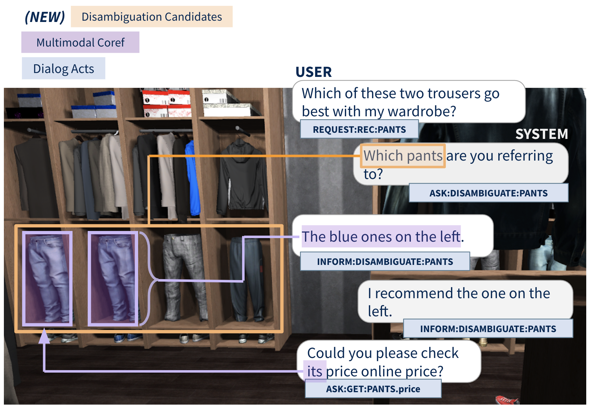

# The Third Situated Interactive MultiModal Conversations (SIMMC 2.1) Challenge 2022

Welcome to the Third Situated Interactive Multimodal Conversations (SIMMC 2.1) Track page for [DSTC11][dstc11] 2022.

The SIMMC challenge aims to lay the foundations for the real-world assistant agents that can handle multimodal inputs, and perform multimodal actions.
Specifically, we focus on the **task-oriented** dialogs that encompass a **situated** multimodal user context in the form of a co-observed & immersive virtual reality (VR) environment.
The conversational context is **dynamically** updated on each turn based on the user actions (e.g. via verbal interactions, navigation within the scene).

The [Second SIMMC challenge][simmc2.0] ended successfully, receiving a number of new state-of-the-art models in the novel multimodal dialog task.
Building upon the success of the previous editions of the SIMMC challenges, we propose a third edition of the SIMMC challenge for the community to tackle and continue the effort towards building a successful multimodal assistant agent.

In this edition of the challenge, we specifically focus on the key challenge of *fine-grained visual disambiguation*, which adds an important skill to assistant agents studied in the previous SIMMC challenge. To accommodate for this challenge, we provide the improved version of the of the dataset, SIMMC 2.1, where we augment the SIMMC 2.0 dataset with additional annotations (i.e. identification of all possible referent candidates given ambiguous mentions) and corresponding re-paraphrases to support the study and modeling of visual disambiguation (SIMMC 2.1).

On Nov 4, 2022, the SIMMC challenge has successfully ended, receiving 15 model submissions across 5 teams from universities and industry. We thank everyone for their participation in the challenge. The detailed evaluation metrics and the links to the repositories will soon be made available publicly.

**Organizers**: Seungwhan Moon, Satwik Kottur, Babak Damavandi, Alborz Geramifard

<figure>
 
<figcaption><i>Illustration of the SIMMC 2.1 Dataset</i></figcaption> 
</figure>


### Latest News

* **[Nov 4, 2022]** Results for DSTC11-SIMMC2.1 challenge entries have been announced. 
* **[Oct 21, 2022]** Test-std dataset (SIMMC v2.1) is released. Start of Challenge Period 2.
* **[June 28, 2022]** DSTC11-SIMMC2.1 Challenge announcement. Training / development datasets (SIMMC v2.1) are released.


## Important Links

* [SIMMC 2.1 Challenge Proposal][simmc2.1_proposal] (DSTC11)
* [Task Description Paper][simmc2_arxiv] (EMNLP 2021)
* [Data Formats](data/README.md)

## Timeline

**NOTE**: All deadlines are 11:59PM UTC-12:00 ("anywhere on Earth"), unless otherwise noted.

| **Date** | **Milestone** |
| :--: | :-- |
| June 28, 2022 | Training & development data released |
| ***Oct 21***, 2022  | Test-Std data released, End of Challenge Phase 1 |
| ***Oct 28***, 2022 | Entry submission deadline, End of Challenge Phase 2 |
| ***Nov 4***, 2022 | Final results are announced (15 model submissions). |
| ***Nov 18***, 2022 | Deadline for DSTC11 Workshop Paper Submission |

## Track Description

### Tasks and Metrics

For this edition of the challenge, we focus on four sub-tasks primarily aimed at replicating human-assistant actions in order to enable rich and interactive shopping scenarios.

For more detailed information on the new SIMMC 2.1 dataset and the instructions, please refer to the [DSTC11 challenge proposal document][simmc2.1_proposal].

| Sub-Task #1 | [Ambiguous Candidate Identification (New)](model/ambiguous_candidates) |
|---------|---------------------------------------------------------------------------------------------------------------------------------------|
| Goal | Given ambiguous object mentions, to resolve referent objects to thier canonical ID(s). |
| Input | Current user utterance, Dialog context, Multimodal context |
| Output |  Canonical object IDs |
| Metrics | Object Identification F1 / Precision / Recall |

| Sub-Task #2 | [Multimodal Coreference Resolution](model/mm_dst) |
|---------|---------------------------------------------------------------------------------------------------------------------------------------|
| Goal | To resolve referent objects to thier canonical ID(s) as defined by the catalog. |
| Input | Current user utterance, Dialog context, Multimodal context |
| Output |  Canonical object IDs |
| Metrics |  Coref F1 / Precision / Recall |

| Sub-Task #3 | [Multimodal Dialog State Tracking (MM-DST)](model/mm_dst) |
|---------|---------------------------------------------------------------------------------------------------------------------------------------|
| Goal | To track user belief states across multiple turns |
| Input | Current user utterance, Dialogue context, Multimodal context |
| Output | Belief state for current user utterance |
| Metrics | Slot F1, Intent F1 |

| Sub-Task #4 | [Multimodal Dialog Response Generation](model/mm_dst)  |
|---------|---------------------------------------------------------------------------------------------------------------------------------------|
| Goal | To generate Assistant responses  |
| Input | Current user utterance, Dialog context, Multimodal context, (Ground-truth API Calls) |
| Output | Assistant response utterance |
| Metrics | BLEU-4 |


Please check the [task input](./TASK_INPUTS.md) file for a full description of inputs
for each subtask.

### Baseline Results

We will provide the baselines for all the four tasks to benchmark their models.
Feel free to use the code to bootstrap your model.

| Subtask | Name | Baseline Results | 
| :--: | :--: | :--: |
| #1 | Ambiguous Candidate Identification | [Link][subtask1_results] |
| #2 | Multimodal Coreference Resolution | [Link][subtask2_results] |
| #3 | Multimodal Dialog State Tracking (MM-DST) | [Link][subtask3_results] |
| #4 | Multimodal Dialog Response Generation | [Link][subtask4_results] |


## How to Download Datasets and Code

* Git clone our repository to download the datasets and the code. You may use the provided baselines as a starting point to develop your models.
```
$ git lfs install
$ git clone https://github.com/facebookresearch/simmc2.git
```

* Also please feel free to check out other open-sourced repositories from the previous SIMMC 2.0 challenge [here](CHALLENGE_RESULTS.md).


## Challenge Instructions

### (1) Reporting Results for Challenge Phase 1 (by Oct 21)
* Submit your model prediction results on the `devtest` set, following the [submission instructions](./SUBMISSION_INSTRUCTIONS.md). 
* We will release the `test-std` set (with ground-truth labels hidden).

### (2) Reporting Results for Challenge Phase 2 (by Oct 28)
* Submit your model prediction results on the `test-std` set, following the [submission instructions](./SUBMISSION_INSTRUCTIONS.md). 
* We will evaluate the participants’ model predictions using the same evaluation script for Phase 1, and announce the results.


## Contact

### Questions related to SIMMC Track, Data, and Baselines
Please contact simmc@fb.com, or leave comments in the Github repository.

### DSTC Mailing List
If you want to get the latest updates about DSTC10, join the [DSTC mailing list](https://groups.google.com/a/dstc.community/forum/#!forum/list/join).


## Citations

If you want to publish experimental results with our datasets or use the baseline models, please cite the following articles:

```
@inproceedings{kottur-etal-2021-simmc,
    title = "{SIMMC} 2.0: A Task-oriented Dialog Dataset for Immersive Multimodal Conversations",
    author = "Kottur, Satwik  and
      Moon, Seungwhan  and
      Geramifard, Alborz  and
      Damavandi, Babak",
    booktitle = "Proceedings of the 2021 Conference on Empirical Methods in Natural Language Processing",
    month = nov,
    year = "2021",
    address = "Online and Punta Cana, Dominican Republic",
    publisher = "Association for Computational Linguistics",
    url = "https://aclanthology.org/2021.emnlp-main.401",
    doi = "10.18653/v1/2021.emnlp-main.401",
    pages = "4903--4912",
}
```
**NOTE**: The [paper][simmc2_arxiv] (EMNLP 2021) above describes in detail the datasets, the collection process, and some of the baselines we provide in this challenge. 

## License

SIMMC 2 is released under [CC-BY-NC-SA-4.0](https://creativecommons.org/licenses/by-nc-sa/4.0/legalcode), see [LICENSE](LICENSE) for details.


[dstc11]:https://dstc11.dstc.community/
[dstc10]:https://sites.google.com/dstc.community/dstc10/home
[simmc1]:https://github.com/facebookresearch/simmc
[simmc2_arxiv]:https://arxiv.org/pdf/2104.08667.pdf
[simmc_arxiv]:https://arxiv.org/abs/2006.01460
[subtask1_results]:./model/ambiguous_candidates#performance-on-simmc-21
[subtask2_results]:./model/mm_dst#results
[subtask3_results]:./model/mm_dst#results
[subtask4_results]:./model/mm_dst#results
[simmc2.0]:./dstc10/CHALLENGE_RESULTS.md
[simmc2.1_proposal]:https://drive.google.com/file/d/1_Tdl7CXm71gqlWutbOe0e8O1hhiycsQf/view
